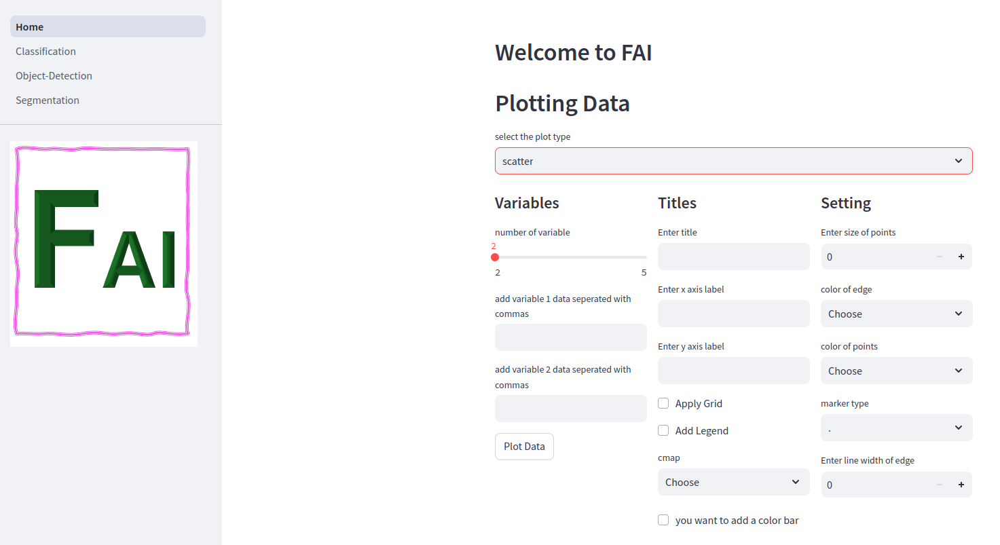

# Data Plotting App
In this app, we implemented different kind of plots. User need to select how many variables he want to plot and first variable will be used as x-axis variable. Use "Plot Data" button to plot your data.


## How to use
Clone the repository and create a virtual environment first and activate it

```console
python3 -m venv .venv
source .venv/bin/activate
```
then install the requirements

```console
pip install -r requirements.txt
```
Now run the backend which will be running on 8080 port. 

```console
cd backend
python3 main.py
```
Verify the running of backend by seeing a welcome message on http://localhost:8080/. Then from main repository run the app 

```console
streamlit run frontend/Home.py
```
The app will run on http://localhost:8501/. Enjoy plotting